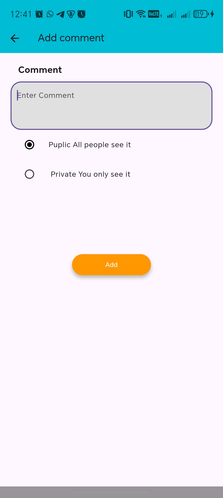
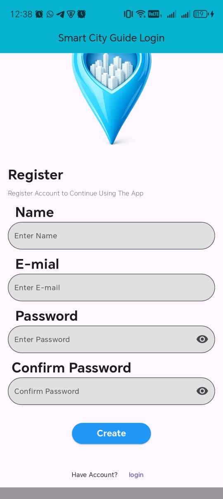
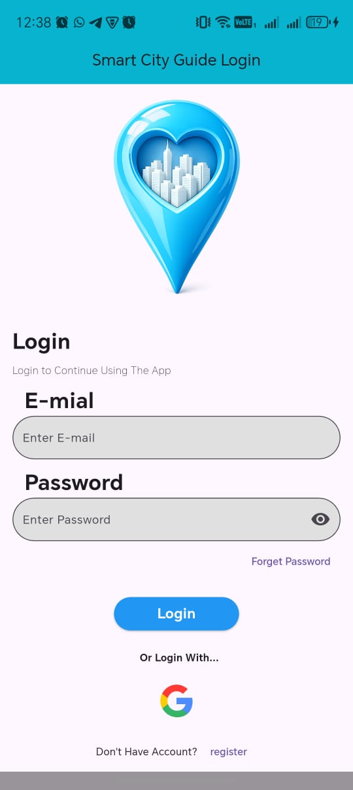

# 🏙️ Smart City Guide

**Smart City Guide** is a Flutter application designed to help tourists and locals explore top attractions and restaurants in Egypt’s major cities (Cairo, Giza, Luxor, Aswan).  
The app focuses on clean UI, responsiveness, and real-time data from Firebase.

---

## 📱 App Screenshots

| Screen | Screenshot |
|--------|------------|
| **Login Screen** – Email, password, and Google sign-in |  |
| **Home Screen** – Browse attractions, restaurants, and hotels |  |
| **Place Details** – View description, location, and actions |  |
| **Favorites** – Saved places for quick access |  |
| **Add Place** – Form to add new places with image upload |  |
| **Drawer** – Navigation menu with user info and options |  |
| **Search** – Find places by name |  |
| **Reviews** – Read and add comments |  |
| **Comments Section** – User comments and interactions |  |
| **Map Integration** – Location and distance calculation |  |
| **Profile** – User profile and settings |  |
| **Register** – Create new account |  |
| **Alerts & Dialogs** – Permission and confirmation dialogs |  |
| **Place Card** – Grid view of places |  |
| **Location Permission** – Enable location services |  |
| **Notification** – Push notification example |  |
| **Responsive UI** – Tablet or different screen size |  |

> *The app adapts smoothly to different screen sizes (Mobile / Tablet).*

---

## ✨ Key Features

- 🗺️ Browse popular tourist attractions, restaurants, and hotels  
- 🔍 Search places by name  
- ❤️ Save/remove favorite places  
- ➕ Add new places with image uploads  
- 💬 Add comments and reviews  
- 🔔 Push notifications (Firebase Cloud Messaging)  
- 📱 Responsive UI (Mobile + Tablet)  

---

## 🛠️ Tech Stack

- **Framework:** Flutter & Dart
- **State Management:** setState, FutureBuilder, StreamBuilder (learning Provider/Bloc)
- **Backend:** Firebase (Auth, Firestore, Storage)
- **Image Storage:** Supabase Storage
- **Maps:** Geolocator + Google Maps API (ready)
- **Notifications:** Firebase Cloud Messaging

---

## 🚀 How to Run

1. Clone the repository:
```bash
git clone https://github.com/TahaKospar/smart-city-guide.git
2.Install dependencies:
    flutter pub get
3.Run the app:
    flutter run

📂 Project Structure
assets/
├── images
└── icons

lib/
├── details.dart
├── homePage.dart
├── page1.dart
└── main.dart


👨‍💻 Author

Taha Kospar

🎓 Delta Technological University (DTU)
🏫 Faculty of Industry & Energy Technology
💻 Department: Information Technology (IT)
🚀 Focus: Flutter & Mobile App Development
